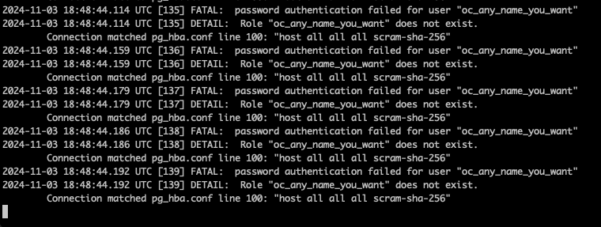

> [!NOTE]  
> Вопрос: важен ли порядок выполнения этих манифестов? Почему?
> 
> Ответ: да, важен. Ввиду того, что дейплоймант постгреса необходимо получить данные из configmap, поэтому configmap должен быть запущен раньше деплойманта, иначе деплоймнат будет падать с ошибкой

> [!NOTE]  
> Вопрос: что (и почему) произойдет, если отскейлить количество реплик postgres-deployment в 0, затем обратно в 1, после чего попробовать снова зайти на Nextcloud?
> 
> Ответ: под nextcloud продолжит работать, но все запросы будут неудачными (доказательства ниже). Это произошло из-за того, что мы фактически уничтожили базу данных, к которой первоначально подключился nextcloud и создал определенные объекты. Из-за того что сам под nextcloud мы не перезапускали, он продолжает считать, что объекты в базе данных созданы, в то время как при пересоздании реплики postgres все было уничтожено.



## Задание
## 1. Для постгреса перенести POSTGRES_USER и POSTGRES_PASSWORD из конфигмапы в секреты
```yaml
apiVersion: v1
kind: Secret
metadata:
  name: postgres-secret
  labels:
    app: postgres
type: Opaque
stringData:
  POSTGRES_USER: "postgres"
  POSTGRES_PASSWORD: "my_super_secret_password"
```
Добавим еще одну секцию в блок envFrom в yaml/pg_deployment.yml
```yaml
- secretRef:
    name: postgres-secret
```
Применим все получившиеся конфигурации postgres:
- ```kubectl apply -f manifests/pg_secrets.yml``` 
- ```kubectl apply -f manifests/pg_configmap.yml```
- ```kubectl apply -f manifests/pg_service.yml```
- ```kubectl apply -f manifests/pg_deployment.yml```

#### 2. Для некстклауда перенести его переменные (```NEXTCLOUD_UPDATE```, ```ALLOW_EMPTY_PASSWORD``` и проч.) из деплоймента в конфигмапу (очевидно, понадобится новый манифест для сущности ConfigMap)
Добавим в существующий файл ```nextcloud.yml``` секцию с configmap
```yaml
apiVersion: v1
kind: ConfigMap
metadata:
  name: nextcloud-configmap
  labels:
    app: nextcloud
data:
  NEXTCLOUD_UPDATE: '1'
  ALLOW_EMPTY_PASSWORD: 'yes'
  POSTGRES_HOST: "postgres-service"
  NEXTCLOUD_TRUSTED_DOMAINS: "127.0.0.1"
  NEXTCLOUD_ADMIN_USER: "any_name_you_want"
```
Добавим секцию envFrom в deployment yaml/nextcloyd.yml, и удалим захардкоженные переменные ( NEXTCLOUD_UPDATE , ALLOW_EMPTY_PASSWORD и проч.)
```yaml
envFrom:
  - configMapRef:
      name: nextcloud-configmap
```
3. Для некстклауда добавить Liveness и Readiness пробы
```yaml
livenessProbe:
  tcpSocket: # На какой TCP сокет отправляем liveness пробу
    port: 80
  initialDelaySeconds: 15 # Подождать 15 секунд с момента запуска пода
  periodSeconds: 10 # Каждые 10 секунд
  timeoutSeconds: 10 # Подождать 10 секунд после проваленной пробы
  failureThreshold: 3 # Количество проваленных проб после которых под умирает
  successThreshold: 1 # Количество успешных проб после которых под считается живым
readinessProbe:
  tcpSocket: # На какой TCP сокет отправляем readiness пробу
    port: 80
  initialDelaySeconds: 15 # Подождать 15 секунд с момента запуска пода
  periodSeconds: 10 # Каждые 10 секунд
  timeoutSeconds: 10 # Подождать 10 секунд после проваленной пробы
  failureThreshold: 3 # Количество проваленных проб после которых под умирает
  successThreshold: 1 # Количество успешных проб после которых под считается живым
```
Применяем команду
```bash
kubectl apply -f manifests/nextcloud.yml
```
