#### ДЗ4
Проект состоит из/включает все требования:
- 5 Deployment(kafka, zookeeper, akhq, producer, consumer)
- 2 кастомных образа
- Deployment producer.yaml содержит в себе контейнер и инит-контейнер
- 2 Deployment содержит Volume(kafka-pv и logs-pv)
- Использование ConfigMap
- 3 Service(akhq-service, kafka-service, zookeeper-service)
- добавлены Liveness и Readiness проба в Deployment akhq.yaml
- используется почти в каждом файле

### Запуск проекта
```bash
minikube start
```
Каждый файл представляет цельное приложение со всеми нужными для него манифестами
Создано 2 namespace:
1. Очередь сообщений(kafka)
```bash
kubectl apply -f ./manifests/kafka.yaml
```
UI интерфейс для kafka
```bash
kubectl apply -f ./manifests/akhq.yaml
```
2. Продюсер и сабскрайбер
Билдим образ:
```bash
docker build -t app_init_consumer:latest -f ./old_system/Dockerfile_consumer ./old_system
docker build -t app_init_producer:latest -f ./old_system/Dockerfile_producer ./old_system
```
Пуллим образ в миникуб
```bash
minikube image load app_init_consumer:latest
minikube image load app_init_producer:latest
```
Запускаем сервисы
```bash
kubectl apply -f ./manifests/producer.yaml
kubectl apply -f ./manifests/consumer.yaml
```
### Скриншоты работы:
запуск миникуба
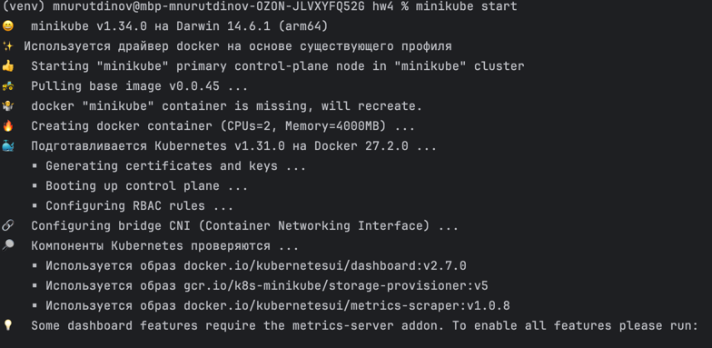
Запускам очередь сообщений(kafka)
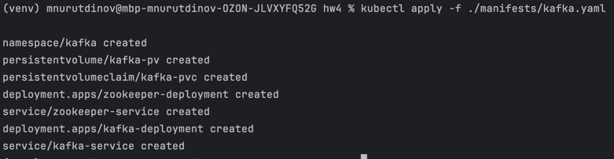
Запускам UI интерфейс для kafka
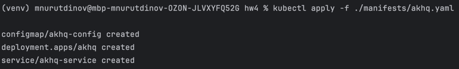
Билдим образы:
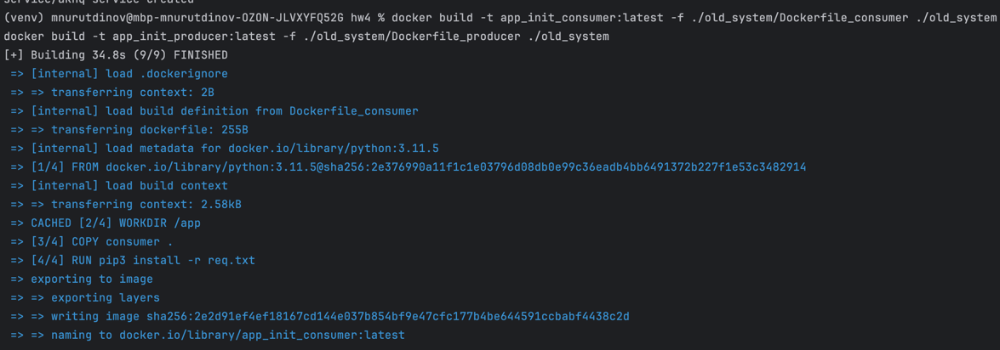
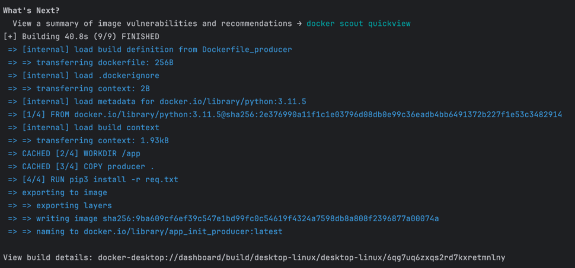
Пуллим образ в миникуб
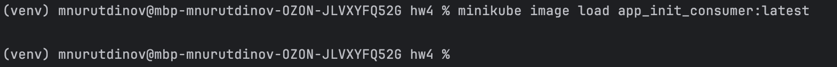
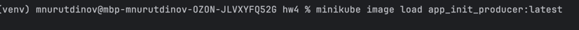
Запускаем сервисы

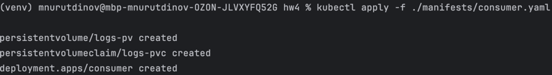
### Результаты
namespace default(с инит контейнером)
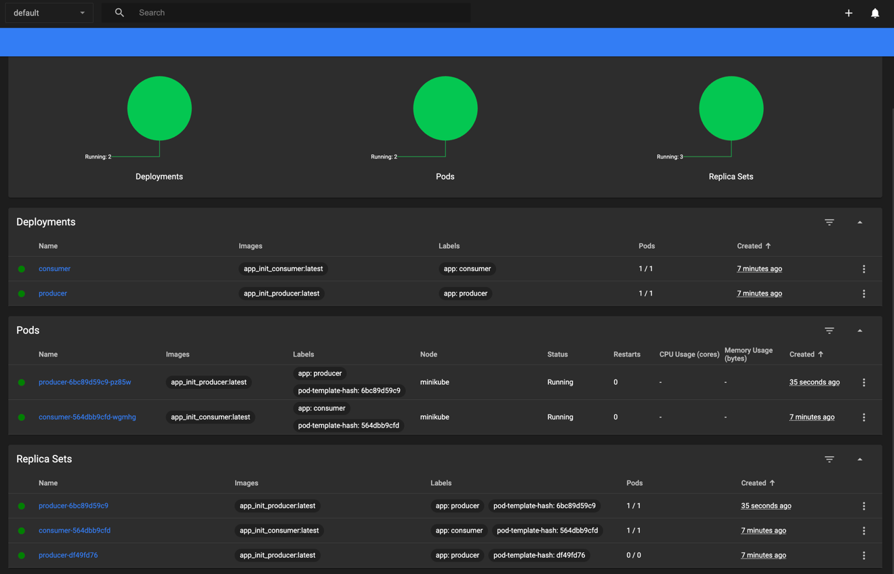
namespace kafka
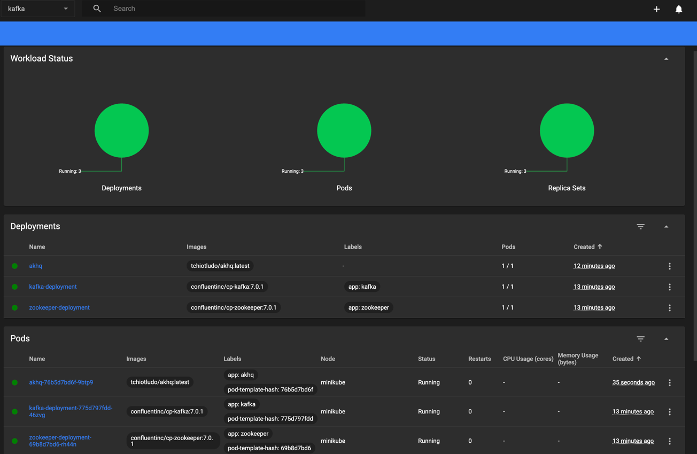
Можем стянуть с миникуба данные с volume
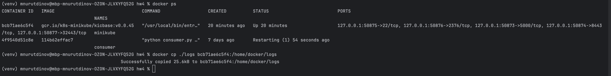
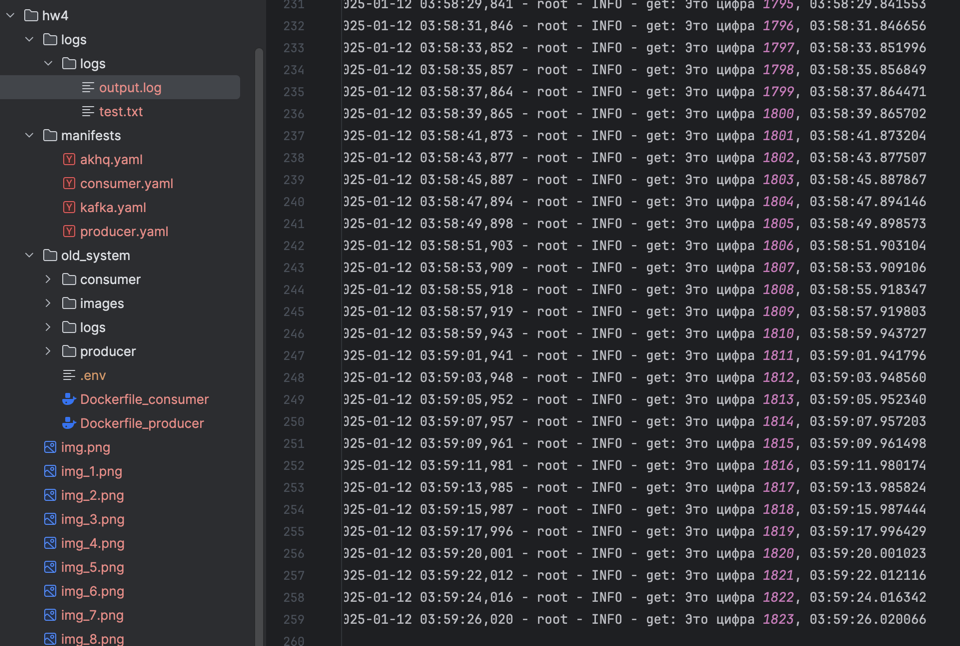
p.s minikube mount не работает на arm системе(много гуглил, подошло только через docker cp)